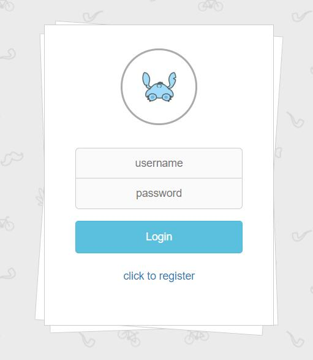
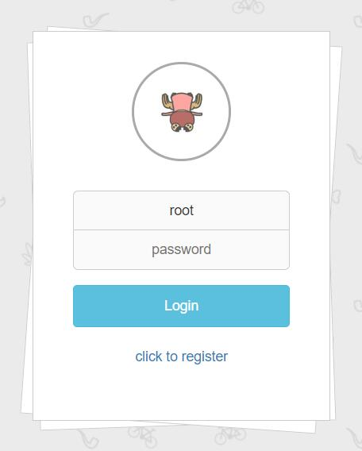

# 登录时异步修改用户头像

为了提高用户在登录时的使用体验，通过监听用户名输入框的 focusout 事件，当该事件发生时，通过 ajax 异步获取用户头像。

```js
var userNameInput = $("input[name=userName]");
userNameInput.focusout(function ()
{
    $.ajax({
            url: "getUserHeadPic.html",
            type: "post",
            dataType: "text",
            data: {
                userName: userNameInput.val()
            },
            success: function (headpic)
            {
                replaceHeadPic(headpic);
            }
    });
}
```





# 异步删帖

考虑到用户在删帖后想继续浏览剩下的帖子，因此采用异步的方式进行删帖，删帖之后不需要刷新页面。

删帖成功之后，会将该帖子隐藏。为了更好的体验，隐藏过程设置了一个 200 毫秒的延迟，从而具有一个短暂的隐藏动画效果。

```js
var deleteBlog = $("#delete-blog");

deleteBlog.on("click", function ()
{
    var blogid = deleteBlog.attr("blogid");
    var blogDiv = $("#blog-" + blogid.toString());
    $.ajax({
        url: "editBlog.html",
        type: "post",
        dataType: "text",
        data: {
            blogId: blogid
        },
        success: function ()
        {
            blogDiv.hide(200);
        }
    });
})
```


